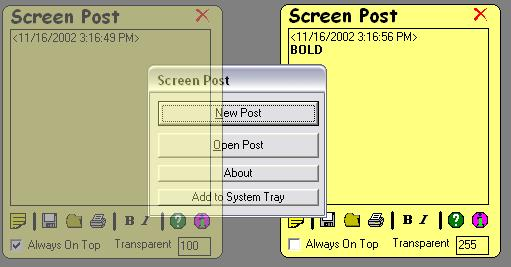

## Screen Post 4 \- You will really like it now

### Description

I have added a lot more features that the old Screen Post didn't have. It has Always on Top, Skinning Module, Transparentacy, Auto Save, Run on Start-up, Add to System tray, Rich Text Box Features, Printing, And more. Please leave a comment and/or vote. If u have any ideas or want into the next version, email me at dogbonevb@hotmail.com
 
### More Info
 

             |
---                |---
**Submitted On**   |2002-11-16 15:20:14
**By**             |[Will Wharton](https://github.com/Planet-Source-Code/PSCIndex/blob/master/ByAuthor/will-wharton.md)
**Level**          |Intermediate
**User Rating**    |5.0 (10 globes from 2 users)
**Compatibility**  |VB 6\.0
**Category**       |[Complete Applications](https://github.com/Planet-Source-Code/PSCIndex/blob/master/ByCategory/complete-applications__1-27.md)
**World**          |[Visual Basic](https://github.com/Planet-Source-Code/PSCIndex/blob/master/ByWorld/visual-basic.md)
**Archive File**   |[Screen\_Pos14984511162002\.zip](https://github.com/Planet-Source-Code/will-wharton-screen-post-4-you-will-really-like-it-now__1-40776/archive/master.zip)

